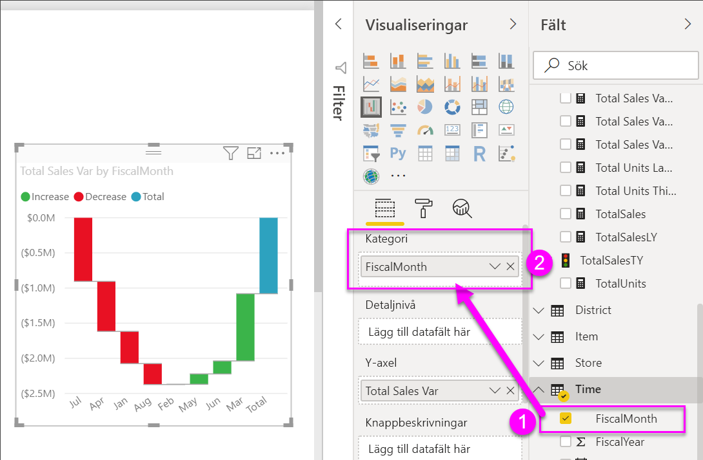
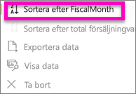

# Vattenfallsdiagram i Power BI
Ett vattenfallsdiagram visar en löpande summa efter hand som värden adderas eller subtraheras. Det är användbart för att förstå hur ett startvärde (till exempel nettointäkter) påverkas av en serie positiva och negativa förändringar.

Kolumnerna är färgkodade så att du snabbt kan se ökningar och minskningar. Kolumnerna med start- och slutvärde [startar ofta på den horisontella axeln](https://support.office.com/article/Create-a-waterfall-chart-in-Office-2016-for-Windows-8de1ece4-ff21-4d37-acd7-546f5527f185#BKMK_Float "startar ofta på den horisontella axeln"), medan de mellanliggande värdena är flytande kolumner. På grund av det här utseendet kallas också vattenfallsdiagram ibland för brodiagram.

<iframe width="560" height="315" src="https://www.youtube.com/embed/qKRZPBnaUXM" frameborder="0" allow="autoplay; encrypted-media" allowfullscreen></iframe>

## När du ska använda ett vattenfallsdiagram
Vattenfallsdiagram är ett bra alternativ

* när ändringar inträffar för måttet över tidsserier eller olika kategorier
* för att granska de viktigaste ändringarna som bidrar till det totala värdet
* för att rita företagets årliga vinst genom att visa olika intäktskällor och komma fram till den totala vinsten (eller förlusten)
* för att illustrera inledande och avslutande personalstyrka för ditt företag under ett år
* för att visualisera hur mycket pengar ni tjänar och spenderar varje månad och den löpande balansen för räkenskaperna. 

## Skapa ett vattenfallsdiagram
Vi ska skapa ett vattenfallsdiagram som visar försäljningsvarians (uppskattad försäljning jämfört med faktisk försäljning) per månad. Om du vill hänga på loggar du in i Power BI och väljer **Hämta data \> Exempel \>Exempel på detaljhandelsanalys**. 

1. Välj fliken **Datauppsättningar** och bläddra till den nya datauppsättningen ”Exempel på detaljhandelsanalys”.  Välj ikonen **Skapa rapport** för att öppna datauppsättningen i rapportredigeringsvyn. 
   
    
2. Välj **Försäljning \> Total Sales Variance (Varians total försäljning)** på panelen **Fält**. Om **Total Sales Variance (Varians total försäljning)** inte finns i **Y-axelområdet** drar du den dit.
3. Konvertera diagrammet till ett **vattenfallsdiagram**. 
   
    
4. Välj **Tid** \> **FiscalMonth (Räkenskapsmånad)** och lägg till det i området **Kategori**. 
   
    
5. Sortera vattenfallsdiagrammet kronologiskt. Välj ellipserna (...) i övre högra hörnet och välj **FiscalMonth (Räkenskapsmånad)**.
   
    
   
    
6. Gräv lite djupare för att se vad som bidrar mest till ändringarna månad för månad. Dra **Butik** > **Territorium** till bucketen **Detaljnivå**.
   
    
7. Som standard lägger Power BI till de fem främsta bidragande faktorerna för ökning eller minskning per månad. Men vi är bara intresserade av de två främsta.  Välj **Detaljnivå** på formateringspanelen och ange **Maximum** till 2.
   
    
   
    En snabb genomgång visar att territorierna Ohio och Pennsylvania står för de största rörelserna, både negativa och positiva, i vårt vattenfallsdiagram. 
   
    
8. Det här är ett intressant fynd. Har Ohio och Pennsylvania så stor inverkan eftersom försäljningen i dessa två territorier är mycket högre än i de andra territorierna?  Det kan vi kontrollera. Skapa en karta som tittar närmare på försäljningen per territorium.  
   
    
   
    Kartan stöder vår teori.  Den visar att dessa två territorier hade det högsta försäljningsvärdet förra året (bubbelstorlek) och det här året (bubbelskuggning).

## Markering och korsfiltrering
Information om hur du använder filterfönstret finns i [Lägg till ett filter i en rapport](../power-bi-report-add-filter.md).

Om du markerar en kolumn i ett vattenfallsdiagram, korsfiltreras de övriga visualiseringarna på rapportsidan, och vice versa. Kolumnen för det totala värdet utlöser dock ingen markering och svarar inte på korsfiltrering.

## Nästa steg
[Rapporter i Power BI](../service-reports.md)

[Visualiseringstyper i Power BI](power-bi-visualization-types-for-reports-and-q-and-a.md)

[Visualiseringar i Power BI-rapporter](power-bi-report-visualizations.md)

[Power BI – grundläggande begrepp](../service-basic-concepts.md)

Har du fler frågor? [Prova Power BI Community](http://community.powerbi.com/)

