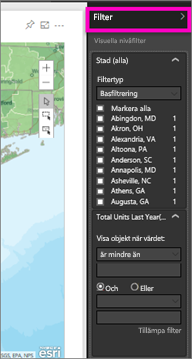
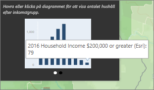
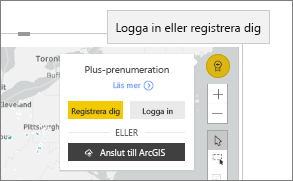

# Interagera med ArcGIS-kartor i Power BI
Det här avsnittet skrivs utifrån perspektivet för en person som *använder* en ArcGIS-karta i Power BI-tjänsten, Desktop eller i en mobil lösning. När en skapare har delat en ArcGIS-karta med dig, finns det många sätt att interagera med den.  Mer information om hur du skapar en ArcGIS-karta finns i [självstudierna om ArcGIS-kartor från Esri](../visuals/power-bi-visualization-arcgis.md).

Kombinationen av ArcGIS-kartor och Power BI tar mappning längre än till bara presentation av punkter på en karta – helt enkelt till en helt ny nivå. De tillgängliga alternativen för grundläggande kartor, platstyper, teman, symbolformat och referensskikt skapar fantastiska informativa kartvisualiseringar. Kombinationen av redigerbara dataskikt (som insamlade data) på en karta med spatial analys ger en bättre förståelse av dina data i visualiseringen.

> [!TIP]
> GIS står för Geographic Information System.
> 

Exemplet vi använder tittar på förra årets försäljning per stad och använder en grundläggande gatukarta, bubbelsymboler för att representera storlek och ett referensskikt för hushållens genomsnittliga inkomst. Kartan innehåller tre stift och en körtidsradie (i lila).

> [!TIP]
> Besök [Esris sida om Power BI](https://www.esri.com/powerbi) för att visa de många exemplen eller läsa kundutlåtanden. Gå sedan till Esris [startsida för att komma igång med ArcGIS Maps för Power BI](https://doc.arcgis.com/en/maps-for-powerbi/get-started/about-maps-for-power-bi.htm).
> 
> 

 

## Användargodkännande
Första gången en kollega delar en ArcGIS-karta med dig, visar Power BI en prompt. ArcGIS Maps for Power BI tillhandahålls av Esri (www.esri.com) och din användning av ArcGIS Maps for Power BI är föremål för Esris villkor och sekretesspolicy. Power BI-användare som vill använda de visuella objekten i ArcGIS Maps för Power BI måste ge sitt godkännande i dialogrutan.

## Valverktyg
Du kan välja tre lägen i ArcGIS Maps för Power BI. Du kan välja högst 250 datapunkter i taget.

 Välj enskilda datapunkter.

 Ritar en rektangel på kartan och väljer de inneslutna datapunkterna. Håll ned CTRL om du vill välja fler än ett rektangulärt område.

 Tillåter att gränser eller polygoner inom referensskikt kan användas för att markera inneslutna datapunkter.

 

## Interagera med en ArcGIS-karta
Vilka funktioner som är tillgängliga beror på om du är *skaparen* (personen som gjort kartan) eller *konsumenten* (någon har delat en ArcGIS-karta med dig). Om du interagerar med en ArcGIS-karta som konsument (det vill säga i [Läsvyn](../consumer/end-user-reading-view.md)), kan du utföra följande åtgärder.

* Om du är en Premium-konsument med *visningsbehörigheter* kan du [visa data som används för att skapa visualiseringen](../consumer/end-user-show-data.md) , [prenumerera](../consumer/end-user-subscribe.md), visa kartan i [fokusläge och fullskärmsläge](../consumer/end-user-focus.md), [visa relaterat innehåll](../consumer/end-user-related.md), [interagera med filtren](../consumer/end-user-report-filter.md) som angetts av *rapportskaparen*, [dela rapporten](../service-share-reports.md) med mera.

* Precis som med andra visualiseringstyper kan Power BI **Pro**-konsumenter kan göra allt som Premium-konsumenten kan göra, plus [exportera underliggande data](../visuals/power-bi-visualization-export-data.md), [hämta användningsstatistik](../service-usage-metrics.md), spara en kopia och [publicera på webben](../service-publish-to-web.md) med mera.

    
* Expandera panelen **Filter** för att utforska kartan med hjälp av filter.   
      
* Om kartan har ett referensskikt kan du välja platser där du vill visa detaljer i en knappbeskrivning. Här har vi valt Adams County för att visa data från referensskiktet för den genomsnittliga hushållsinkomsten som skaparen har lagts till i kartan.
  
      
  
    I det här fallet få vi också ett diagram. Välj en stapel i diagrammet för att få mer information om dina data. Här ser vi att 79 hushåll i Adams County tjänar 200 000 dollar eller mer.
  
    
  
    Välj pilen för att visa alla ytterligare diagram.
* Hovra över den grundläggande kartans platssymboler för att visa information i en knappbeskrivning.     
  
  
  > [!TIP]
  > Du kan behöva zooma in för att välja en viss plats.  Annars kan det hända att Power BI, om det finns överlappande platser, kan visa dig mer än en knappbeskrivning i taget. Välj pilarna för att flytta mellan knappbeskrivningarna.
  > 
  > 
  > 
  > 
* Om skaparen har lagt till ett informationsgrafikskikt i ArcGIS-kartan, visas ytterligare data i det övre högra hörnet på kartan.  Här lade till exempel kartskaparen till ”barn under 14”.
  
    

## Överväganden och begränsningar
ArcGIS Maps för Power BI finns tillgängligt i följande tjänster och appar:

<table>
<tr><th>Tjänst/app</th><th>Tillgängligt</th></tr>
<tr>
<td>Power BI Desktop</td>
<td>Ja</td>
</tr>
<tr>
<td>Power BI-tjänsten (app.powerbi.com)</td>
<td>Ja</td>
</tr>
<tr>
<td>Power BI Mobile-appar</td>
<td>Ja</td>
</tr>
<tr>
<td>Power BI Publicera på webben</td>
<td>Nej</td>
</tr>
<tr>
<td>Power BI Embedded</td>
<td>Nej</td>
</tr>
<tr>
<td>Power BI-tjänstinbäddning (PowerBI.com)</td>
<td>Nej</td>
</tr>
</table>

**Hur fungerar ArcGIS Maps for Power BI?**
ArcGIS Maps for Power BI tillhandahålls av Esri (www.esri.com). Din användning av ArcGIS Maps for Power BI är föremål för Esris [villkor](https://go.microsoft.com/fwlink/?LinkID=8263222) och [sekretesspolicy](https://go.microsoft.com/fwlink/?LinkID=826323). Power BI-användare som vill använda de visuella objekten i ArcGIS Maps for Power BI måste ge sitt godkännande i dialogrutan (mer information finns i avsnittet Användargodkännande).  Användningen av ArcGIS Maps for Power BI från Esri är föremål för Esris villkor och sekretesspolicy. Det finns länkar till dessa från dialogrutan för godkännande. Alla användare måste ge sitt godkännande innan de kan börja använda ArcGIS Maps for Power BI. När användaren gett sitt godkännande skickas data som är kopplade till den visuella informationen till Esris tjänster för geokodning (eller mer), vilket innebär att platsinformationen omvandlas till latitud- och longitudinformation som kan visas på en karta. Utgå från att alla data som är kopplade till datavisualiseringen kan skickas till Esris tjänster. Esri tillhandahåller tjänster som grundläggande kartor, spatialanalyser, geokodning osv. De visuella objekten i ArcGIS Maps for Power BI samverkar med dessa tjänster genom en SSL-anslutning som skyddas av ett certifikat som tillhandahålls och hanteras av Esri. Mer information om ArcGIS Maps for Power BI finns på Esris [produktsida för ArcGIS Maps for Power BI](https://www.esri.com/powerbi).

**Power BI Plus**    

När användare registrerar sig för en Plus-prenumeration på ArcGIS Maps for Power BI från Esri, upprättar de en direkt relation med Esri. Power BI skickar ingen personlig information om användaren till Esri. Användaren loggar in i och har förtroende för ett AAD-program som tillhandahålls av Esri med sin egen AAD-identitet. Därmed delar användaren sin personliga information direkt med Esri. När användaren lägger till Plus-innehåll till ett visuellt objekt i ArcGIS Maps for Power BI måste andra Power BI-användare också ha en Plus-prenumeration från Esri för att kunna visa eller redigera innehållet. 

Kontakta Esri via deras supportwebbplats om du har frågor som rör mer detaljerad teknisk information om hur Esris ArcGIS Maps for Power BI fungerar.

**ArcGIS-kartan visas inte**    
I tjänster eller program där ArcGIS Maps för Power BI inte är tillgängligt, visas visualiseringen som ett tomt visuellt objekt med Power BI-logotypen.

**Jag kan inte se all min information på kartan**    
När du geokodar latituden/longituden på kartan visas upp till 30 000 datapunkter. Vid geokodning av datapunkter som postnummer eller gatuadresser geokodas bara de första 15 000 datapunkterna. Geokodning av platsnamn eller länder omfattas inte av gränsen på 1 500 adresser.

**Kostar det något att använda ArcGIS Maps för Power BI?**

ArcGIS Maps för Power BI är tillgängligt för alla Power BI-användare utan extra kostnad. Det är en komponent som tillhandahålls av **Esri** och din användning är föremål för de villkor och den sekretesspolicy som tillhandahålls av **Esri**, i enlighet med vad som nämnts tidigare i den här artikeln. Om du prenumererar på ArcGIS **Plus** tas en avgift ut.

**Jag får ett felmeddelande om att mitt cacheminne är fullt**

Detta är ett programfel som vi håller på att åtgärda.  Välj under tiden länken som visas i felmeddelandet för anvisningar om hur du rensar ditt Power BI-cacheminne.

**Kan jag visa mina ArcGIS-kartor offline?**

Nej, Power BI behöver nätverksanslutning för att visa kartor.

## Nästa steg
Få hjälp: **Esri** tillhandahåller [omfattande dokumentation](https://go.microsoft.com/fwlink/?LinkID=828772) om funktionsuppsättningen i **ArcGIS Maps för Power BI**.

Du kan ställa frågor, hitta den senaste informationen, rapportera problem och få svar i Power BI-[communityns tråd om **ArcGIS Maps för Power BI**](https://go.microsoft.com/fwlink/?LinkID=828771).

[Produktsida för ArcGIS Maps för Power BI](https://www.esri.com/powerbi)
