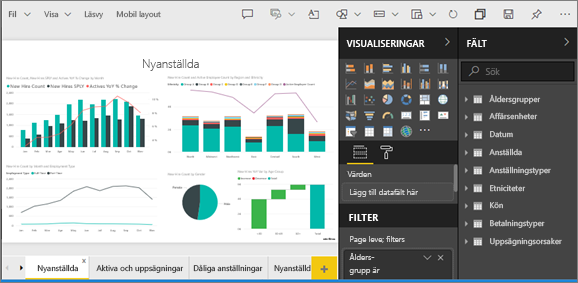
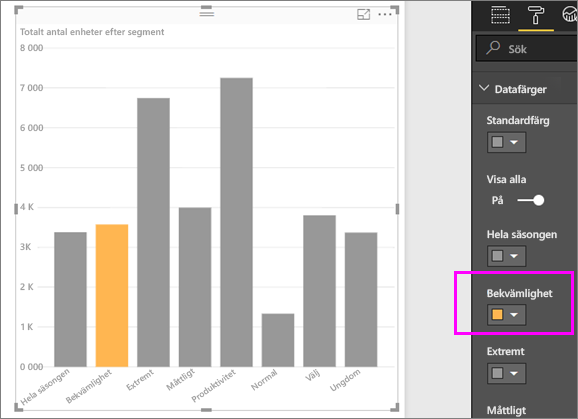
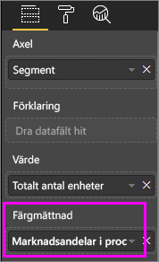
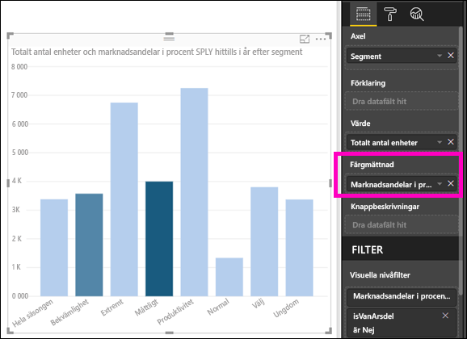
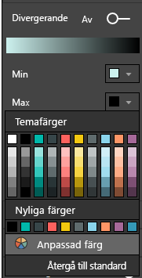
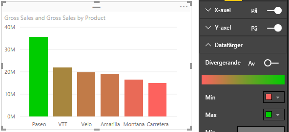
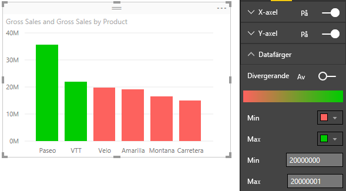
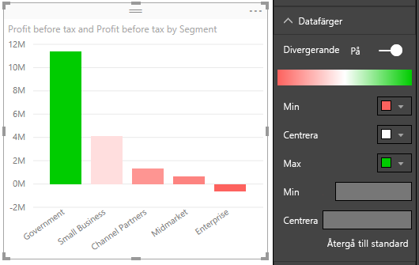

# Tips för färgformatering i Power BI
Power BI erbjuder många olika sätt på vilka du kan anpassa dina instrumentpaneler och rapporter. Den här artikeln innehåller detaljerad information om en samling tips med vilkas hjälp du kan göra dina Power BI-visualiseringar mer intressanta och anpassade efter dina behov.

Följande tips tillhandahålls. Har du ytterligare något bra tips? Toppen! Skicka det till oss, så ska vi se till att lägga till det på listan.

* Ändra färg på en enskild datapunkt
* Basera färgerna i ett diagram på ett numeriskt värde
* Basera datapunkternas färg på ett fältvärde
* Anpassa färgerna som används i färgskalan
* Använda avvikande färgskalor
* Hur du ångrar i Power BI

Om du vill göra några ändringar måste du redigera en rapport. Öppna rapporten och välj **Redigera rapport** från menyområdet, enligt följande bild.

När fönstret **Visualiseringar** visas utmed den högra sidan av arbetsytan **Rapport** och du kan börja anpassa. Om fönstret inte visas klickar du på pilen i det övre högra hörnet att öppna det.

## Ändra färg på en enskild datapunkt
Ibland vill du kanske markera en viss datapunkt. Kanske gäller det försäljningssiffrorna i samband med lanseringen av en ny produkt, eller förbättrade kvalitetsresultat när du startar ett nytt program. Med Power BI kan du markera en viss datapunkt genom att ändra dess färg.

Följande visualisering rangordnar enheter sålda per produktsegment. 

Anta nu att du vill att anropa segmentet **Bekvämlighet** för att visa hur väl den här helt nya segmentet fungerar, genom att använda färg. Gör så här:

Expandera avsnittet **Datafärger** och aktivera skjutreglaget för **Visa alla**. Då visas färgerna för varje dataelement i visualiseringen. När du hovrar över datapunkter är bläddring aktiverat, så kan du kan modifiera valfria datapunkter.

Ställ in **Bekvämlighet** på orange. 

När du är klar visas datapunkten **Bekvämlighet** med en fin orange nyans som verkligen står ut.

Även om du ändrar visualiseringstyper, och sedan går tillbaka, så kommer Power BI ihåg ditt val och bevarar **Bekvämlighet** orange.

Du kan ändra färg på en datapunkt för ett, flera eller alla dataelement i visualiseringen. Kanske vill du att ditt visuella objekt ska efterlikna företagets färger. 

Det finns olika typer av saker du kan göra med färger. I nästa avsnitt ta vi en titt på toningar.

## Basera färgerna i ett diagram på ett numeriskt värde
Diagram tjänar ofta på att man använder dynamisk färginställning som baseras på fältens numeriska värden. Med den här metoden kan du visa ett annat värde än vad som används för stapelns storlek, och visa två värden i ett enskilt diagram. Eller så kan du använda det för att markera datapunkter över (eller under) ett visst värde – t.ex. områden med låg lönsamhet.

I följande avsnitt visar vi olika sätt på vilka man kan basera färger på numeriska värden.

## Basera datapunkternas färg på ett värde
Om du vill ändra färg utifrån ett värde, så dra det fält som du vill basera färgen på till fältet **Färgmättnad** i fönstret **Fält**. I följande bild har **%Marknadsandel SPLY YTD** dragits till **Färgmättnad**. 

På formateringspanelen under **Datafärger** ska du fastställa hur värdet för **% Marknadsandel SPLY YTD** kommer att ändra färg och skuggning i ditt stapeldiagram. I det här exemplet kommer en lägre %Marknadsandel att vara ljusare blå och högre värden kommer att vara mörkare blå.

Här kan vi se att även om vi har sålt fler enheter av både **Produktivitet** och **Extrem** (deras kolumner är högre) så har**Moderering** större **%Marknadsandel SPLY YTD** (dess kolumn har högre färgmättnad).

## Anpassa färgerna som används i färgskalan
Du kan även anpassa färgerna som används i färgskalan. Det lägsta värdet i dina data mappas som standard till den minst mättade färgen, och det högsta värdet mappas till den mest mättade färgen. I bilden ovan använde vi en blå toning. 

Expandera **Datafärger**. Då visas en färgtoning som används för att visualisera dina data. Färgintervallet visas i en toningsstapel som visar spektrumet mellan färgvärdena **lägsta** och **högsta**, med **lägsta** färgvärdet till vänster och **högsta** färgvärdet till höger.

Om du vill ändra skalan och använda en annan uppsättning färger, så välj färglistrutan bredvid **lägsta** eller **högsta** och välj en färg. Följande bild visar hur den **högsta** färgen ändrats till svart och toningsstapeln visar det nya spektrumet mellan **lägsta** och **högsta**.

Du kan också ändra hur värdena mappas till dessa färger. I följande bild har färgerna för **lägsta** och **högsta** ställts in på orange respektive grönt.

Notera hur diagramstaplarna i den första bilden reflekterar den toning som visas i stapeln. Det högsta värdet är grönt, det lägsta är orange, och varje mellanliggande stapel har en färgton som ligger i spektrumet någonstans mellan grönt och orange.

Nu ska vi se vad som händer om vi tillhandahåller numeriska värden i värderutorna **Lägsta** och **Högsta** som är lägre än värdena i färgväljarna **Lägsta** och **Högsta** (se följande bild). Vi ställer in **Lägsta** på 20 000 000 och **Högsta** på 20 000 001.

Om du anger dessa värden så tillämpas inte toningen längre på värden i diagrammet som är lägre än **Lägsta** eller högre än **Högsta**. Alla staplar med värden över **Högsta** färgas gröna, och alla staplar med värden under **Lägsta** färgas röda.

## Använda avvikande färgskalor
Ibland kan dina data ha en naturligt avvikande skala. Ett temperaturintervall har ett naturligt centrum vid fryspunkten, och en lönsamhetsskala har en naturlig mittpunkt (noll).

Om du vill använda avvikande färgskalor så dra skjutreglaget **Avvikande** till **På**. När du har aktiverat **Avvikande** visas ytterligare en färgväljare och en värderuta, som båda kallas **Mitten**, så som visas på följande bild.

När skjutreglaget **Avvikande** har aktiverats kan du ange färgerna för **Lägsta**, **Högsta** och **Mitten** separat. I följande bild har **Mitten** ställts in på ett, så staplar med värden över ett utgör olika toningar av grönt, och staplar med värden under ett utgör olika toningar av rött.

## Hur du ångrar i Power BI
Precis som med många andra Microsoft-tjänster och program så erbjuder Power BI ett enkelt sätt på vilket du kan ångra ditt senaste kommando. Låt oss säga att du t.ex. ändrar färg på en datapunkt, eller en serie datapunkter, och du inte tycker om färgen när den visas i visualiseringen. Du kommer inte ihåg exakt vilken färg du hade tidigare, men du vill ha tillbaka den!

Om du vill **ångra** din senaste åtgärd, eller ett antal av dina senaste åtgärder, är allt du behöver göra följande:

- Skriv CTRL + Z

## Feedback
Har du något tips som du vill dela? Skicka det till oss, så ska vi se till att lägga till det här.

>[!NOTE]
>Dessa färger, axlar och relaterade anpassningar är tillgängliga när ikonen **Format** är markerad, och de är också tillgängliga i Power BI Desktop.

## Nästa steg
[Komma igång med färgformatering och axelegenskaper](service-getting-started-with-color-formatting-and-axis-properties.md)

