# Tips för färgformatering i Power BI
Power BI erbjuder många olika sätt på vilka du kan anpassa dina instrumentpaneler och rapporter. Den här artikeln innehåller detaljerad information om en samling tips med vilkas hjälp du kan göra dina Power BI-visualiseringar mer intressanta och anpassade efter dina behov.

Följande tips tillhandahålls. Har du ytterligare något bra tips? Toppen! Skicka det till oss, så ska vi se till att lägga till det på listan.

* Använd ett tema för hela rapporten
* Ändra färg på en enskild datapunkt
* Villkorsstyrd formatering
* Basera färgerna i ett diagram på ett numeriskt värde
* Basera datapunkternas färg på ett fältvärde
* Anpassa färgerna som används i färgskalan
* Använda avvikande färgskalor
* Lägg till färg till tabellrader
* Hur du ångrar i Power BI

Om du vill göra några ändringar måste du ha redigeringsbehörigheter för rapporten. Öppna rapporten i **rapportvyn** i Power BI Desktop. I Power BI-tjänsten innebär detta att du öppnar rapporten och väljer **Redigera** på menyraden, så som visas på följande bild.

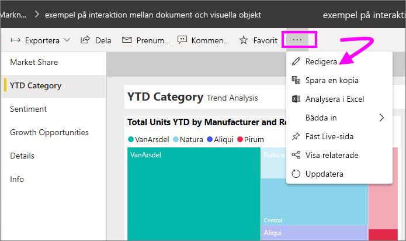

När du ser fönstren **Filter** och **Visualiseringar** till höger på rapportarbetsytan kan du börja anpassa rapporten. Om du inte ser de här fönstren väljer du pilen uppe till höger för att öppna dem.

## Använda ett tema
Med rapportteman kan du tillämpa designändringar i hela rapporten, till exempel genom att använda företagsfärger, ändra ikonuppsättningar eller använda ny förvald visuell formatering. När du tillämpar ett rapporttema kommer färgerna och formateringen från det valda temat att användas för alla visuella objekt i rapporten. Läs mer i [Använda rapportteman](../desktop-report-themes.md)

Här har vi använt temat **Innovate** i rapporten Sales and Marketing.

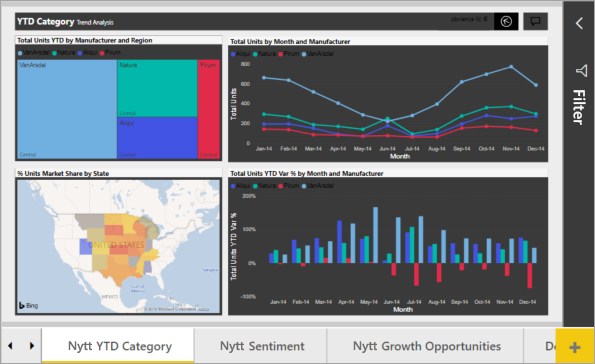

## Ändra färg på en enskild datapunkt
Ibland vill du kanske markera en viss datapunkt. Kanske gäller det försäljningssiffrorna i samband med lanseringen av en ny produkt, eller förbättrade kvalitetsresultat när du startar ett nytt program. Med Power BI kan du markera en viss datapunkt genom att ändra dess färg.

Följande visualisering rangordnar enheter sålda per produktsegment. 

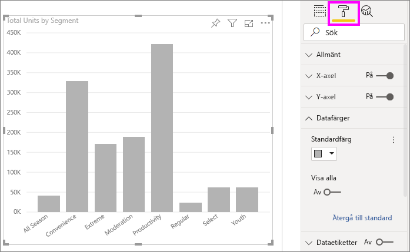

Anta nu att du vill att anropa segmentet **Bekvämlighet** för att visa hur väl den här helt nya segmentet fungerar, genom att använda färg. Gör så här:

Visa kortet **Datafärger** och aktivera skjutreglaget för **Visa alla**. Då visas färgerna för varje dataelement i visualiseringen. Du kan nu ändra vilken som helst av datapunkterna.

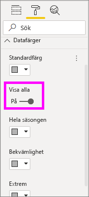

Ställ in **Bekvämlighet** på orange. 

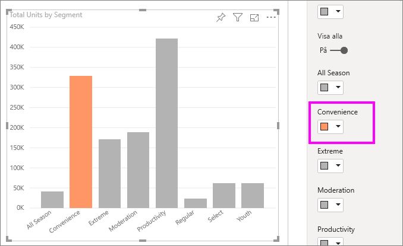

När du är klar visas datapunkten **Bekvämlighet** med en fin orange nyans som verkligen står ut.

Även om du ändrar visualiseringstyper, och sedan går tillbaka, så kommer Power BI ihåg ditt val och bevarar **Bekvämlighet** orange.

Du kan ändra färg på en datapunkt för ett, flera eller alla dataelement i visualiseringen. Kanske vill du att ditt visuella objekt ska ha företagets färger som är gult, grönt och blått. 

Det finns olika typer av saker du kan göra med färger. I nästa avsnitt ta vi en titt på villkorsstyrd formatering.

## Villkorsstyrd formatering för visuella objekt
Visualiseringar blir ofta bättre om du använder dynamiska färginställningar som baseras på fältens numeriska värden. På så sätt kan du visa ett annat värde än vad som används för stapelns storlek, och visa två värden i samma diagram. Eller så kan du använda det för att markera datapunkter över (eller under) ett visst värde – t.ex. områden med låg lönsamhet.

I följande avsnitt visar vi olika sätt på vilka man kan basera färger på numeriska värden.

### Basera datapunkternas färg på ett värde
Om du vill ändra färg baserat på ett värde väljer du en visualisering för att göra den aktiv. Öppna formateringsfönstret genom att välja rollerikonen och visa sedan kortet **Datafärger**. Hovra över kortet, välj de tre lodräta punkterna som visas och sedan **Villkorsstyrd formatering**.  

Använd listrutorna i fönstret **Standardfärger** till att identifiera vilka fält som villkorsstyrd formatering ska användas för. I det här exemplet har vi valt fältet **Sales fact** > **Total Units** och valt ljusblå färg för **Lowest value** samt mörkblå färg för **Highest value**. 

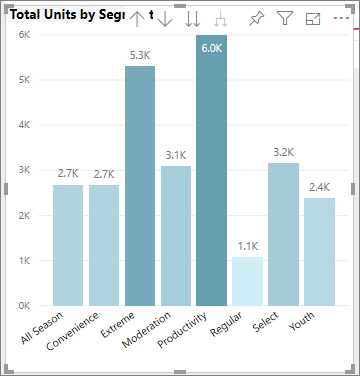

Du kan också formatera färgen för det visuella objektet med hjälp av ett fält som inte ingår i det visuella objektet. I följande bild används **%Market Share SPLY YTD**. 

Även om vi har sålt fler enheter av både **Productivity** och **Extreme** (deras kolumner är högre) så ser du att **Moderation** har större **%Market Share SPLY YTD** (kolumnen har högre färgmättnad).

### Anpassa färgerna som används i färgskalan
Du kan också ändra hur värdena mappas till dessa färger. I följande bild har färgerna för **lägsta** och **högsta** ställts in på orange respektive grönt.

Notera hur diagramstaplarna i den första bilden reflekterar den toning som visas i stapeln. Det högsta värdet är grönt, det lägsta är orange, och varje mellanliggande stapel har en färgton som ligger i spektrumet någonstans mellan grönt och orange.

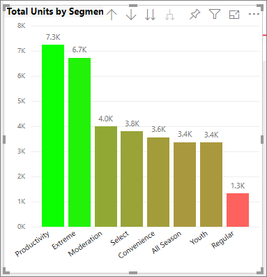

Nu ska vi se vad som händer om vi tillhandahåller numeriska värden i värdefälten **Minimum** och **Maximum**. Välj **Anpassad** från listrutorna för både **Lägsta** och **Högsta**. Sätt **Lägsta** till 3 500 och **Högsta** till 6 000.

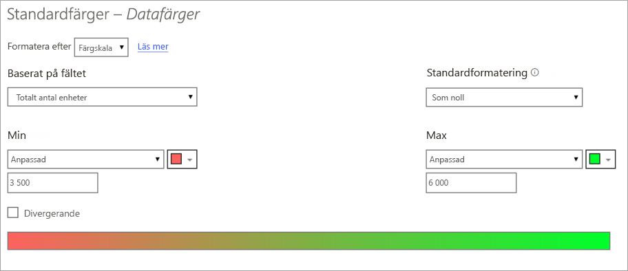

Om du anger dessa värden så tillämpas inte toningen längre på värden i diagrammet som är lägre än **Lägsta** eller högre än **Högsta**. Alla staplar med värden över **Högsta** färgas gröna, och alla staplar med värden under **Lägsta** färgas röda.

### Använda avvikande färgskalor
Ibland kan dina data ha en naturligt avvikande skala. Ett temperaturintervall har ett naturligt centrum vid fryspunkten, och en lönsamhetsskala har en naturlig mittpunkt (noll).

Om du vill använda divergerande färgskalor markerar du kryssrutan **Divergerande**. När du har aktiverat **Divergerande** visas ytterligare en färgväljare som kallas **Mitten**, som du ser i följande bild.

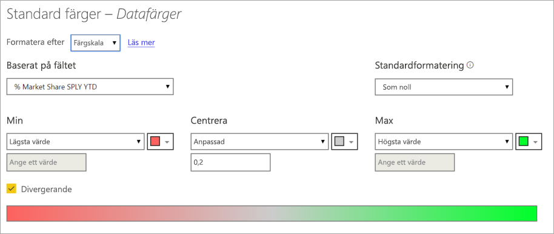

När skjutreglaget **Avvikande** har aktiverats kan du ange färgerna för **Lägsta**, **Högsta** och **Mitten** separat. I följande bild är **Center** (Mitten) inställt på .2 för **% Market Share SPLY YTD**, så staplar med värden över .2 har olika toningar av grönt medan staplar med värden under har olika toningar av rött.

## Lägg till färg till tabellrader
Tabeller och matriser erbjuder många alternativ för färgformatering. 

Ett av de snabbaste sätten att använda färger på i en tabell eller matris är att öppna fliken Formatering och välja **Format**.  På bilden nedan har **Fet rubrik, pråliga rader** valts.

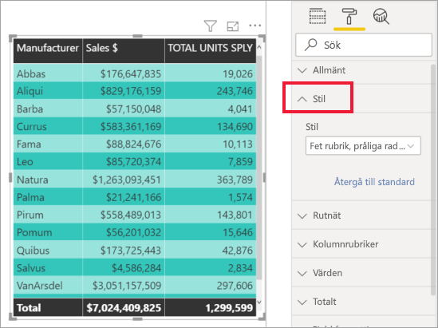

Experimentera med andra färgformateringsalternativ. På den här bilden har vi ändrat bakgrundsfärgen under **Kolumnrubriker** och ändrat både **Bakgrundsfärg** och **Alternativ bakgrundsfärg** för **Värden** (rader).

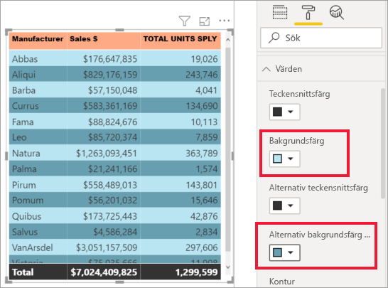

## Hur du ångrar i Power BI
Precis som med många andra Microsoft-tjänster och program så erbjuder Power BI ett enkelt sätt på vilket du kan ångra ditt senaste kommando. Låt oss säga att du t.ex. ändrar färg på en datapunkt, eller en serie datapunkter, och du inte tycker om färgen när den visas i visualiseringen. Du kommer inte ihåg exakt vilken färg du hade tidigare, men du vill ha tillbaka den!

Om du vill **ångra** en eller flera åtgärder trycker du bara Ctrl+Z.

Om du vill ignorera alla ändringar som du har gjort på ett formateringskort, så välj **Återgå till standard**.

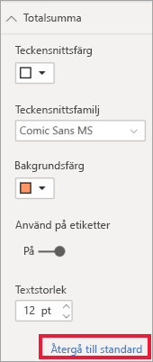

## Feedback
Har du något tips som du vill dela? Skicka det till oss, så ska vi se till att lägga till det här.

## Nästa steg
[Komma igång med färgformatering och axelegenskaper](service-getting-started-with-color-formatting-and-axis-properties.md)

